# Forven Architecture

> Generated from the **GitNexus code knowledge graph** — 22,345 symbols, 55,777 relationships, 300 execution flows across 1,252 source files.
>
> Languages: Python 864 · Svelte 182 · TypeScript 147 · HTML 9 · JS 6 · Bash 2 · YAML 2 · TOML 1

## Overview

Forven is a **local-first algorithmic trading operations framework**: an autonomous workspace for quantitative strategy creation, backtesting, deployment, and risk management. It runs entirely on your machine with SQLite persistence and optional AI-provider integration.

```
┌─────────────────────────────────────────────────────────────┐
│                    SvelteKit Frontend                        │
│   /  /agents  /ai-dropzone  /approval  /data  /lab          │
│   /memory  /ops  /risk  /runs  /settings  /tasks  /trades   │
└──────────────────┬──────────────────────────────────────────┘
                   │ HTTP + WebSocket
                   ▼
┌─────────────────────────────────────────────────────────────┐
│                    FastAPI Backend (:8003)                    │
│                                                              │
│  ┌──────────┐ ┌───────────┐ ┌──────────┐ ┌──────────────┐  │
│  │ Routers  │ │ Control   │ │ API      │ │ Middleware    │  │
│  │ (27 mods)│ │ Plane     │ │ Domains  │ │ CORS / Auth   │  │
│  └────┬─────┘ └─────┬─────┘ └────┬─────┘ │ Compat / Corr │  │
│       │             │            │       └──────────────┘  │
│       ▼             ▼            ▼                          │
│  ┌─────────────────────────────────────────────────────┐   │
│  │              Core Business Logic                     │   │
│  │  Strategy Engine  │ Trading Bot  │ AI/Brain         │   │
│  │  Backtesting      │ Lab/Research │ Scheduler/Daemon │   │
│  │  Exchange / CCXT  │ Scanner      │ Gauntlet         │   │
│  │  Data Engine      │ Agent System │ Bot Factory      │   │
│  └───────────────────────┬─────────────────────────────┘   │
│                          │                                  │
│  ┌───────────────────────┼─────────────────────────────┐   │
│  │          Persistence  │                              │   │
│  │  ┌──────────┐  ┌──────┴──────┐  ┌──────────────┐   │   │
│  │  │ SQLite   │  │ ChromaDB    │  │ FORVEN_HOME  │   │   │
│  │  │ (forven) │  │ (vectors)   │  │ workspace/   │   │   │
│  │  └──────────┘  └─────────────┘  └──────────────┘   │   │
│  └─────────────────────────────────────────────────────┘   │
└─────────────────────────────────────────────────────────────┘
```

## Functional Areas (GitNexus Clusters)

The knowledge graph identifies **29 functional modules** via Leiden clustering across 22,345 symbols:

| Functional Area | Symbols | Cohesion | Key Contents |
|-----------------|---------|----------|--------------|
| **Forven** (core) | 223 | 99% | Central app logic, CLI, config, utilities |
| **Tests** | 71 | 11% | Test suites |
| **Tests** | 58 | 78% | Test suites |
| **Exchange** | 45 | 73% | Hyperliquid, order books, risk management |
| **Api** | 44 | 60% | Route handlers |
| **Api** | 41 | 84% | Route handlers |
| **Gauntlet** | 32 | 73% | Robustness testing (Monte Carlo, walk-forward) |
| **Api_domains** | 28 | 66% | Extracted API-facing business logic |
| **Control_plane** | 25 | 26% | Runtime operations and status |
| **Strategies** | 128 | 53% | Strategy base, backtest, optimizer, registry |
| **Agents** | 92 | 52% | AI providers, runner, tool calling |
| **Routers** | 90 | 58% | HTTP route definitions |
| **Dataeng** | 44 | 75% | Data pipeline engine |
| **Builtin** | 31 | 60% | Shipped strategies |
| **Agent** | 23 | 76% | Programmatic client (ForvenAgentClient) |
| **Bot_factory** | 18 | 67% | Bot templates and versioning |
| **Stores** | 17 | 84% | Svelte stores |
| **Auth** | 16 | 60% | OAuth provider management |
| **Mcp_server** | 11 | 100% | MCP server binding |
| **Scripts** | 10 | 60% | Utility/legacy scripts |

**Cross-cutting concern**: `secret_storage.py` appears in nearly every cross-community flow (Fernet-based secret encryption/decryption).

## Layer Architecture

### 1. Frontend — SvelteKit 2 + Svelte 5 + TailwindCSS

**Location**: `frontend/` — 182 Svelte files, 147 TypeScript files.

**Frontend routes** (operator-facing):

| Route | Module | Purpose |
|-------|--------|---------|
| `/` | status | Dashboard with quant_factory/beta views |
| `/agents` | agents | AI agent management and configuration |
| `/ai-dropzone` | strategies | Strategy ideation and AI-assisted creation |
| `/approval` | approvals | Approval workflows for strategy actions |
| `/data` | data | Market data management and ingestion |
| `/lab` | lab | Strategy lab, matrix, and experiments |
| `/lab/strategy/[id]` | lab | Individual strategy detail |
| `/memory` | memory | Vector memory and retrieval |
| `/ops` | ops | System operations and control |
| `/risk` | risk | Risk monitoring and management |
| `/runs` | runs | Backtest and simulation runs |
| `/settings` | settings | Configuration and preferences |
| `/tasks` | tasks | Pipeline tasks and audit |
| `/trades` | trades | Live trade monitoring |

**API connection**: Typed wrappers in `frontend/src/lib/api/` (primarily `forven.ts` with 100+ endpoint functions). Vite dev server proxies `/api` and `/health` to the backend. Direct backend access on port `8003`.

**Key API client modules**:

| File | Coverage |
|------|----------|
| `forven.ts` | Core API — dashboard, strategies, trades, agents, settings |
| `agent.ts` | `ForvenAgent` — programmatic strategy pipeline client |
| Various domain files | Per-feature API wrappers |

---

### 2. Backend — FastAPI (Python 3.11+)

**Location**: `forven/` — 864 Python files across 20 subpackages.

#### 2.1 API Layer — Routers (645 nodes)

The FastAPI app is assembled in `forven/api.py`. 24 router modules registered:

| Router File | Route Prefix | Routes | Purpose |
|-------------|-------------|--------|---------|
| `routers/agents.py` | `/api/agents` | ~20 | AI agent CRUD, provider health, tool sets |
| `routers/analytics.py` | `/api/dashboard/*` | ~12 | Dashboard KPIs, equity curves, funnel |
| `routers/approvals.py` | `/api/approvals` | ~12 | Approval workflow, bulk actions, modes |
| `routers/assistant.py` | `/api/assistant` | ~8 | AI assistant threads and chat |
| `routers/auth.py` | `/api/auth/providers` | ~10 | OAuth provider management |
| `routers/backtesting.py` | `/api/backtesting` | ~12 | Backtest datasets, strategy CRUD |
| `routers/bot_factory.py` | `/api/bot-factory` | ~18 | Bot creation, templates, lifecycle |
| `routers/data.py` | `/api/data/*` | ~30 | Market data ingestion, backfill, quality |
| `routers/deepdive.py` | `/api/deepdive` | ~6 | Deep research threads |
| `routers/hypotheses.py` | `/api/data-gaps` | ~4 | Hypothesis data gaps |
| `routers/jobs.py` | `/api/jobs` | ~6 | Job management |
| `routers/legacy.py` | `/api/forven/*` | ~8 | V1 compatibility routes |
| `routers/lifecycle.py` | `/api/lifecycle/*` | ~6 | Strategy lifecycle |
| `routers/memory.py` | `/api/memory/*` | ~6 | Vector memory access |
| `routers/notifications.py` | `/api/notifications` | ~6 | Notification CRUD |
| `routers/ops.py` | `/api/system/*` | ~8 | Emergency halt, logs, scheduler |
| `routers/paper.py` | `/api/paper/*` | ~8 | Paper trading |
| `routers/quant_factory.py` | `/api/quant-factory` | ~6 | Quant factory operations |
| `routers/robustness.py` | `/api/robustness/*` | ~6 | Robustness testing |
| `routers/simulation.py` | `/api/simulation/*` | ~6 | Simulation engine |
| `routers/status.py` | `/` `/api/dashboard` `/api/health` | ~6 | Health, status, root |
| `routers/strategies.py` | `/api/strategies` `/api/backtesting` | ~30 | Strategy CRUD, backtest runs, AI dropzone |
| `routers/tasks.py` | `/api/tasks` `/api/agent-tasks` | ~6 | Task management |
| `routers/trading.py` | `/api/trades/*` | ~8 | Trade management |
| `routers/verdict.py` | `/verdict/*` | ~4 | Strategy verdicts |
| `routers/webhooks.py` | `/api/webhooks/*` | ~4 | Webhook receivers |
| `routers/websockets.py` | `/api/ws/live` | ~2 | Live WebSocket feed |

**Total**: 866 route nodes in the knowledge graph.

#### 2.2 Core Domain Logic

| Module (by node count) | Nodes | Purpose |
|------------------------|-------|---------|
| `strategies/` | 1,100 | Strategy engine, backtesting, registry, indicators |
| `routers/` | 645 | HTTP route handlers |
| `api_domains/` | 429 | Extracted API-facing business logic |
| `agents/` | 307 | AI provider integration (OpenAI, MiniMax, Codex, LMStudio, ZAI) |
| `exchange/` | 177 | Exchange integrations (CCXT, Hyperliquid) |
| `db/` | 171 | SQLite schema, sessions, migrations |
| `control_plane/` | 164 | Runtime operations, status, approvals |
| `dataeng/` | 149 | Data pipeline, backfill engine |
| `data_manager/` | 89 | Large data management orchestrator |
| `bot_factory/` | 64 | Bot creation, versioning, templates |

#### 2.3 Key Root Modules

| File | Size | Purpose |
|------|------|---------|
| `api.py` | 34K | FastAPI app assembly, lifespan, router registration |
| `api_core.py` | 473K | Startup, compatibility, legacy helpers |
| `brain.py` | 147K | AI brain — chat, decisions, memory, lessons |
| `bot.py` | 113K | Trading bot runtime |
| `evolution.py` | 112K | Strategy evolution engine |
| `cli.py` | 55K | Click CLI (`python -m forven`) |
| `db.py` | 303K | SQLite schema, queries, sessions |
| `policy.py` | 179K | Pipeline stages and gate criteria |
| `scheduler.py` | ~100K | Cron-style scheduler |
| `daemon.py` | 81K | Background daemon loop |
| `data.py` | 74K | Market data download/ingestion |
| `data_manager.py` | 84K | Data management orchestration |
| `lab_db.py` | 92K | Lab database operations |
| `lab_matrix_engine.py` | 84K | Lab matrix computations |
| `notifications.py` | 44K | Notification system |
| `config.py` | 18K | Global configuration |
| `hypotheses.py` | 43K | Hypothesis management |

---

### 3. Strategy Pipeline

The core workflow follows a **5-stage policy pipeline** defined in `forven/policy.py`:

```
researching → backtesting → paper → deployed → retired
```

| Stage | Gate | Description |
|-------|------|-------------|
| Researching | — | Strategy ideation, AI-assisted creation (ai-dropzone) |
| Backtesting | quick_screen, cost_stress | Bar-by-bar engine with vectorized signal generation |
| Paper | deflated_sharpe | Paper trading validation |
| Deployed | — | Live execution via exchange integration |
| Retired | — | Decommissioned strategies |

**Strategy system** (`forven/strategies/`, 1,100 nodes):

- `base.py` — `BaseStrategy` interface (all strategies extend this)
- `backtest.py` — Backtest engine, `run_backtest()`
- `optimizer.py` — Grid search and optimization
- `fitness.py` — Fitness scoring functions
- `registry.py` — Strategy discovery and loading
- `sentiment.py` — Sentiment-based signal helpers
- `indicators.py` — Technical indicator library
- `sizing.py` — Position sizing logic
- `builtin/` — Shipped strategies
- `custom/` — User-created strategies (gitignored)

**Gauntlet** (`forven/gauntlet/`): Robustness testing and evaluation framework that stress-tests strategies across market conditions.

**Lab** (`forven/lab_*`): Strategy experimentation environment with matrix engine, regime detection, worker service, and strategy pool management.

---

### 4. AI/Agent System

**Multi-provider architecture** (`forven/agents/providers.py`):

| Provider | Type | Use |
|----------|------|-----|
| `OpenAIProvider` | Cloud | Primary LLM provider |
| `MiniMaxProvider` | Cloud | Alternative provider |
| `CodexProvider` | Cloud | Code generation specialized |
| `OpenAIAutoProvider` | Cloud | Auto-routed OpenAI |
| `LMStudioProvider` | Local | Local model inference |
| `ZAIProvider` | Cloud | Additional provider |

**Brain** (`forven/brain.py`, 147K): The central AI orchestration module handling chat, decisions, memory, lessons, and recall. Integrates with the agent system to drive strategy creation and analysis.

**Agent Runtime** (`forven/agents/`, 307 nodes): AI agent lifecycle management including provider configuration, tool sets, documents, and terminal access.

---

### 5. Data Layer

**Market data pipeline** (`forven/data.py` + `forven/dataeng/`):

```
Exchange APIs (CCXT/Polygon) → Ingestion Engine → SQLite / Parquet
                                                      ↓
                                              Backtest Engine
                                                      ↓
                                              Lab / Research
```

- `data.py` (74K) — Download, ingestion, backfill, quality checks
- `dataeng/` (149 nodes) — Data pipeline engine
- `data_manager.py` (84K) — Large-scale data management
- `polygon_client.py` — Polygon.io API client
- `market_data.py`, `market_data_collector.py` — Collection orchestration
- `market_cache.py`, `market_calendar.py` — Market metadata

**Persistence**:

| Store | Library | Content |
|-------|---------|---------|
| SQLite | `forven/db.py` | Strategies, trades, tasks, approvals, settings, scheduler state |
| ChromaDB | `forven/vectordb.py` | Vector memory for AI retrieval |
| Filesystem | `FORVEN_HOME/` | Configuration, workspace files, auth tokens |

---

### 6. Exchange Integration

**Location**: `forven/exchange/` — 177 nodes.

- `hyperliquid.py` — Hyperliquid exchange adapter
- `books.py` — Order book management
- `risk.py` — Risk management and position limits
- CCXT-based adapters for additional exchanges

Trading execution flows through `forven/bot.py` (113K) for live bots and `forven/simulation.py` for paper/simulation.

---

### 7. Operational Systems

| System | Module | Purpose |
|--------|--------|---------|
| Scheduler | `forven/scheduler.py` | Cron-style task scheduling and reconciliation |
| Daemon | `forven/daemon.py` | Background loop for continuous operations |
| Bot Factory | `forven/bot_factory/` | Bot creation from templates, version diffs |
| Notifications | `forven/notifications.py` | Multi-channel notification dispatch |
| Health Monitor | `forven/health_monitor.py` | System health and soak reporting |
| Migrations | `forven/migrations.py` | Database schema migrations |

---

### 8. Programmatic Access — `forven.agent`

The `forven/agent/` module provides a zero-dependency HTTP harness over the REST API:

- `ForvenAgentClient` — Python client (enqueue, promote, gate-report)
- CLI — `python -m forven.agent health | list | gate-report | enqueue | wait-paper`
- TypeScript wrapper — `ForvenAgent` in `frontend/src/lib/api/agent.ts`

This is the primary path for programmatic strategy pipeline usage (Codex, CI, sidecars).

---

## Key Execution Flows (GitNexus Process Traces)

The knowledge graph tracks **300 execution flows** across functional areas. The 5 most cross-cutting:

### Flow 1: Paper Trading Session Indicators

*8 steps · 6 communities — Api_domains → Secret_storage → DB*

```
GET /api/paper/sessions/{id}/indicators
    │
    ▼
get_paper_session_indicators  (forven/api_domains/paper.py)
    │  Resolves the paper session
    ▼
_find_compat_paper_session   (forven/api_domains/paper.py)
    │  Locates session in compatible format
    ▼
_collect_compat_paper_sessions (forven/api_domains/paper.py)
    │  Gathers session metadata
    ▼
kv_get                        (forven/db.py)
    │  Reads encrypted config from SQLite
    ▼
decrypt_secret ─→ _get_fernet ─→ _load_fernet_key (forven/secret_storage.py)
    │  Decrypts API keys/config via Fernet
    ▼
_restrict_to_owner            (forven/secret_storage.py)
    │  Ownership guard
```

### Flow 2: Polygon.io Status Check

*7 steps · 5 communities — Data → Config → Secret_storage*

```
GET /api/data/polygon/status
    │
    ▼
get_polygon_status           (forven/routers/data.py)
    │  API route handler
    ▼
get_polygon_api_key          (forven/config.py)
    │  Loads configured API key
    ▼
kv_get ─→ decrypt_secret ─→ _get_fernet ─→ _load_fernet_key ─→ _restrict_to_owner
    │  Full secret decryption chain
```

### Flow 3: Lab Workspace Status

*7 steps · 5 communities — Strategies → Secret_storage → DB*

```
GET /api/strategies (lab context)
    │
    ▼
lab_now_working              (forven/routers/strategies.py)
    │  Lab workspace inquiry
    ▼
kv_get ─→ decrypt_secret ─→ _get_fernet ─→ _load_fernet_key
    │
    ▼
_migrate_legacy_key_if_needed (forven/secret_storage.py)
    │  Key migration (legacy support)
    ▼
_preferred_key_path           (forven/secret_storage.py)
    │  Resolved storage path
```

### Flow 4: Backtest Preview

*6 steps · 5 communities — Api_core → Settings → DB*

```
POST /api/backtests/preview
    │
    ▼
post_backtest_preview        (forven/api_core.py)
    │  Schedules backtest preview run
    ▼
_estimate_backtest_bars      (forven/api_core.py)
    │  Calculates expected bar count
    ▼
get_settings                 (forven/api_core.py)
    │  Loads pipeline settings
    ▼
_load_settings_payload ─→ _default_settings_payload
    │  Resolves settings with defaults
    ▼
_now                         (forven/db.py)
    │  Timestamps the operation
```

### Flow 5: Cost Stress Analysis (Gauntlet)

*6 steps · 6 communities — Robustness → Settings → DB*

```
POST /api/robustness/cost-stress
    │
    ▼
submit_cost_stress           (forven/routers/robustness.py)
    │  Initiates robustness test
    ▼
_run_cost_stress_analysis    (forven/routers/robustness.py)
    │  Runs cost stress scenario
    ▼
get_settings ─→ _load_settings_payload ─→ _default_settings_payload
    │  Settings resolution with fallbacks
    ▼
_now                         (forven/db.py)
    │  Timestamps
```

### Strategy lifecycle flow (conceptual)

```
User/Frontend
    │
    ▼
AI Dropzone (/api/ai-dropzone/sessions)
    │  AI-assisted strategy creation
    ▼
Strategy CRUD (/api/strategies)
    │  Register, version, configure
    ▼
Backtesting (/api/backtesting/run)
    │  quick_screen → cost_stress → deflated_sharpe
    ▼
Paper Trading (/api/paper/*)
    │  Validate with play money
    ▼
Deploy (/api/lifecycle/*)
    │
    ▼
Live Bot (/api/bot-factory/bots/*)
    │  Exchange execution
    ▼
Monitoring (/api/trades/*, /api/dashboard/*)
```

### Data ingestion flow

```
Scheduler tick → Backfill engine → Exchange API → Data quality check → SQLite/Parquet
                                                                           │
                                                                    Notify on completion
```

### AI Brain flow

```
User message → /api/brain/chat → Provider selection → Model invoke
    │                                                       │
    └── Memory retrieval (ChromaDB) ←───────────────────────┘
    │
    └── Tool execution (backtest, scan, evolve, etc.)
    │
    └── Decision recording → Lessons learned
```

---

## Architecture Diagram

```mermaid
graph TB
    %% Frontend Layer
    subgraph Frontend["SvelteKit Frontend (port 5173)"]
        UI["/ (Dashboard)"] 
        AG["/agents"]
        AZ["/ai-dropzone"]
        AP["/approval"]
        DT["/data"]
        LB["/lab"]
        MEM["/memory"]
        OP["/ops"]
        RK["/risk"]
        ST["/settings"]
        TK["/tasks"]
        TR["/trades"]
    end

    %% API Layer
    subgraph API["FastAPI Backend (port 8003)"]
        direction TB
        MW["Middleware: CORS, Auth, V1 Compat, CorrelationId"]
        
        subgraph Routers["24 Router Modules"]
            R_AG["agents.py"]
            R_AN["analytics.py"]
            R_AP["approvals.py"]
            R_AS["assistant.py"]
            R_AU["auth.py"]
            R_BT["backtesting.py"]
            R_BF["bot_factory.py"]
            R_DA["data.py"]
            R_OT["others..."]
        end
        
        subgraph Control["Control Plane"]
            CP["control_plane/"]
        end
        
        subgraph Domains["API Domains"]
            AD["api_domains/"]
        end
    end

    %% Core Systems
    subgraph Core["Core Systems"]
        direction TB
        STRAT["Strategy Engine<br/>(strategies/)"]
        BT["Backtesting Engine<br/>(backtest.py, optimizer.py)"]
        BOT["Trading Bot<br/>(bot.py)"]
        BRAIN["AI Brain<br/>(brain.py)"]
        SCHED["Scheduler / Daemon<br/>(scheduler.py, daemon.py)"]
        DATA["Data Engine<br/>(data.py, dataeng/)"]
        AGENTS["Agent System<br/>(agents/, agent/)"]
        LAB["Lab / Research<br/>(lab_*, hypotheses*)"]
        GAUNT["Gauntlet<br/>(gauntlet/)"]
        BF["Bot Factory<br/>(bot_factory/)"]
        MON["Health Monitor<br/>(health_monitor.py)"]
    end

    %% Exchange Layer
    subgraph Exchange["Exchange Integrations"]
        HL["Hyperliquid"]
        CCXT["CCXT Adapters"]
        POLY["Polygon.io"]
        RISK["Risk Manager"]
    end

    %% Persistence Layer
    subgraph Persistence["Persistence"]
        SQL[("SQLite<br/>Main System of Record")]
        CHROMA[("ChromaDB<br/>Vector Store")]
        FS[("Filesystem<br/>FORVEN_HOME")]
    end

    %% External
    subgraph External["External"]
        AI_PROV["AI Providers<br/>OpenAI / MiniMax / Codex / LMStudio"]
        EXCH["Exchanges"]
        DISC["Discord"]
    end

    %% Connections
    Frontend -->|"HTTP + WebSocket"| API
    MW --> Routers
    Routers --> Control
    Routers --> Domains
    Routers --> Core
    
    STRAT --> BT
    STRAT --> LAB
    STRAT --> GAUNT
    
    BRAIN --> AGENTS
    BRAIN --> AI_PROV
    
    BOT --> Exchange
    BOT --> RISK
    
    DATA --> POLY
    DATA --> SQL
    DATA --> CHROMA
    
    SCHED --> BOT
    SCHED --> DATA
    SCHED --> MON
    
    BF --> BOT
    
    Exchange --> EXCH
    Exchange --> SQL
    
    Core --> Persistence
    
    %% Frontend API wrappers
    UI -->|"fetchApi"| R_AN
    AG --> R_AG
    AZ --> R_OT
    TR --> R_OT
```



## Key Design Decisions

1. **Local-first**: All data lives on the user's machine. No cloud dependency for core functionality.
2. **Policy-gated pipeline**: Strategies progress through stages with quantified gates (quick_screen → cost_stress → deflated_sharpe), not manual promotion.
3. **AI-native**: The brain/agent system is a first-class citizen, not an add-on. Strategy creation, analysis, and decision-making are AI-assisted by design.
4. **Multi-provider LLM**: Pluggable provider architecture supports both cloud and local models.
5. **Vector memory**: ChromaDB for persistent AI memory and retrieval-augmented decision making.
6. **Compatibility layer**: `ForvenV1CompatMiddleware` and legacy routes ensure backward compatibility during active development.

## Project Stats (from GitNexus)

| Metric | Count |
|--------|-------|
| **Source files** | 1,252 |
| **Python files** | 864 |
| **Svelte files** | 182 |
| **TypeScript files** | 147 |
| **Total symbols** | 22,345 |
| **Total relationships** | 55,777 |
| **Execution flows** | 300 |
| **Functional clusters** | 29 |
| **Backend subpackages** | 20 |
| **Router modules** | 27 |
| **AI providers** | 6 |
| **Exchange integrations** | CCXT + Hyperliquid |

## Development Rules

- Use absolute Python imports (`from forven.module import X`)
- Keep backend routers thin; delegate to domain modules
- Add frontend API wrappers instead of raw component fetches
- Treat `forven/exchange/` as sensitive integration code
- Update docs when route surfaces, startup flows, or operator behavior change
